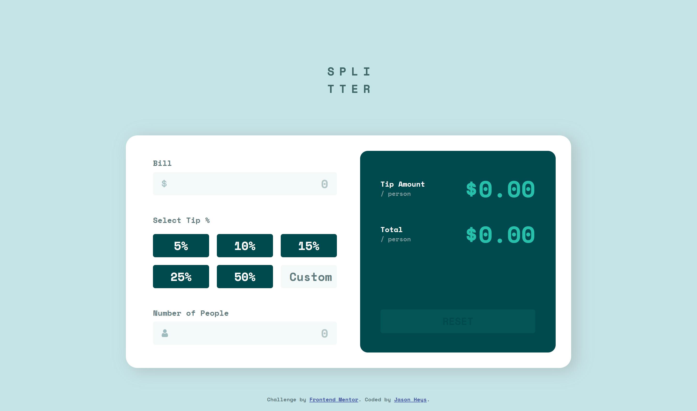

# Frontend Mentor - Tip calculator app solution

This is a solution to the [Tip calculator app challenge on Frontend Mentor](https://www.frontendmentor.io/challenges/tip-calculator-app-ugJNGbJUX). Frontend Mentor challenges help you improve your coding skills by building realistic projects.

## Table of contents

- [Overview](#overview)
  - [The challenge](#the-challenge)
  - [Screenshot](#screenshot)
- [My process](#my-process)
  - [Built with](#built-with)
  - [What I learned](#what-i-learned)
- [Author](#author)
- [Acknowledgments](#acknowledgments)

**Note: Delete this note and update the table of contents based on what sections you keep.**

## Overview

### The challenge

The challenge is to build out this tip calculator app and get it looking as close to the design as possible.

Users should be able to:

- View the optimal layout for the app depending on their device's screen size
- See hover states for all interactive elements on the page
- Calculate the correct tip and total cost of the bill per person

### Screenshot



### Links

- Live Site URL: [https://heyitsgany.github.io/tip-calculator-app/](https://heyitsgany.github.io/tip-calculator-app/)

## My process

### Built with

- Semantic HTML5 markup
- CSS custom properties
- A mix of CSS Grid and Flexbox
- Mobile-first workflow
- JavaScript ES6 classes

### What I learned

I learned a deeper understanding of styling input fields and buttons. Learning to check compatability between browsers.

```css
input::-webkit-inner-spin-button,
input::-webkit-outer-spin-button,
input {
  margin: 0;
  -webkit-appearance: none;
  -moz-appearance: textfield;
}
```

This bit of CSS essentially ensure visual compatability between the different browsers. It removes the spinner arrows from the number input field on all browsers, as well as ensuring that buttons keep the visual styling I have set instead of adopting the Safari browser's default button styling.

I made use of ES6 classes in JavaScript to use private fields and methods, meaning that nothing can be altered via a browser console. It's not necessary in this context, however it is good practice.

## Author

- Frontend Mentor - [@heyitsgany](https://www.frontendmentor.io/profile/heyitsgany)
- Twitter - [@heyitsgany](https://www.twitter.com/heyitsgany)

## Acknowledgments

Thank you to my beautiful wife for her continued support and words of encouragment as I work on these projects and my continued learning of web development.
